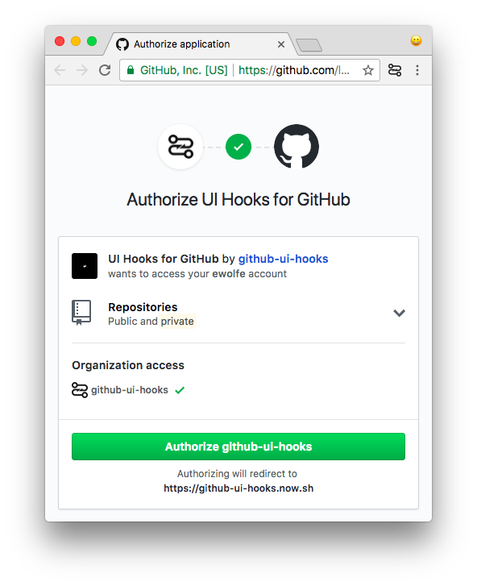

<p align="center">
  
</p>

# GitHub UI Hooks

> UI Hooks for GitHub


## tl;dr

1. Install the [Chrome Extension](https://chrome.google.com/webstore/detail/github-ui-hooks/djlefggoliaabihafpdpalmfgiagpfkb)

2. Authorize the extension

  

3. Add this file to the root of your project:

  ```js
  // .github-ui-hooks.js
  const GITHUB_UI_HOOKS = {
    'pull-request-compare': (meta) => {
      const pullRequestTitleElement = document.getElementById('pull_request_title');
      pullRequestTitleElement.value = 'Hello world';
    }
  }
  ```

4. Open a pull request to see it in action
5. Add more [event hooks](https://github.com/github-ui-hooks/github-ui-hooks/wiki/events)

## What are GitHub UI Hooks?

GitHub UI Hooks are JavaScript functions that execute before or after events that take place within the context of the GitHub UI. These are **not** first class citizens within GitHub or Git itself. A browser extension is needed to execute these scripts and a developer must add the scripts to their repositories in a `.github-ui-hooks.js` file.

These hook scripts are only limited by a developer’s imagination. Some example hooks include:

- `pull-request-compare`: When the compare page for a pull request is opened
- `pull-request-merged`: When a pull request is merged

## How do they work?

GitHub repositories need to add a `.github-ui-hooks.js` file with a map of JavaScript methods for **[each hook you can bind to](https://github.com/github-ui-hooks/github-ui-hooks/wiki/events)**. Then, one of our browser extensions will execute them when those events occur.

## Why should I care?

You should (or shouldn’t) care for the same reasons you care about [traditional githooks](https://git-scm.com/docs/githooks); to trigger actions at certain points in the GitHub workflow.

## I still don’t get it

This project was initially developed to address a small nuisance:

_When a pull request is opened on GitHub it will automatically populate the title like so:_

- If the PR has a single commit, then the PR title is based on that commit message
- If the PR has more than one commit, then the PR title is based on the branch name

This browser extension solves this issue in an automatic fashion by providing an opportunity for __arbitrary code to execute on the GitHub page__ and alter the pull request title.

--

Another use case could be for pseudo [webhooks](https://developer.github.com/webhooks/). For example, you could post a message in a Slack channel anytime a pull request is opened (without the need for setting up an always on event-subscriber server).

## Contribute

We’re seeking feedback in the form of general questions, bug reports, feature requests, pull-requests, and sample scripts.

[Open issue](https://github.com/GitHub-UI-Hooks/github-ui-hooks/issues/new)

## License

MIT

---

###### Credit:

- This README is heavily inspired by http://githooks.com/
- Logomark based on [Rohith M S - Hook](https://thenounproject.com/search/?q=hook&i=942366)
